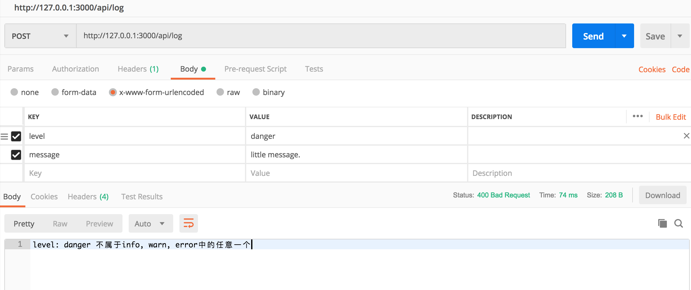
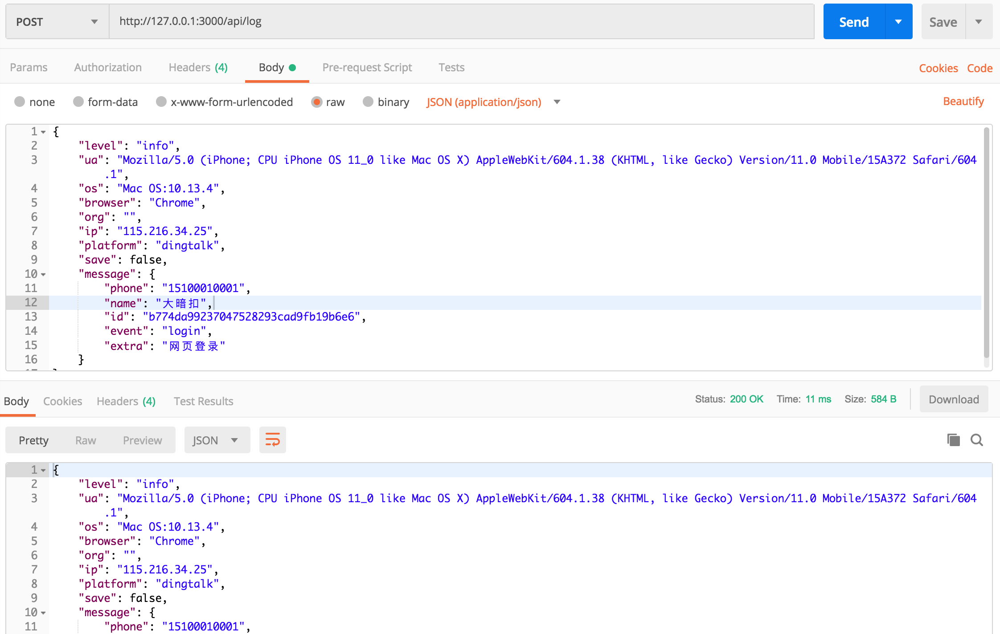

# 前端日志服务

一个利用 winston 来输出日志的 http 服务，koa 作为基础 http 框架。

基础服务不含数据库部分，如需记录到库，可基于项目进行适当扩展。

## 安装依赖

```bash
$ npm i
```

## 运行

```bash
$ npm start
```

## 开发

```bash
$ npm run dev
```

## 开发测试

默认端口为 `3000`，baseUrl `http://127.0.0.1:3000/`。

测试两个链接

- `GET /` - 打印服务名
- `POST /api/log` - logger 日志
  - @param {'info' | 'warn' | 'error'} level
  - @param {object} message





## 部署

先编译，

```bash
$ npm run compile
```

然后使用 `pm2` 部署，项目中使用的部署端口为 `25000`。假设部署的平台里 node 在 path 中(否则 process.yml 文件中解释器使用绝对路径)。

```bash
$ pm2 start process.yml
```

停止服务名为 frontend-logs-node 的 pm2 服务使用下面的命令，

```bash
$ pm2 stop frontend-logs-node
```

可以使用 `pm2 delete <server_name>` 来删除指定的服务。

## 查看 pm2 日志

使用 pm2 的子命令，

```bash
$ pm2 logs --out --lines 500 frontend-logs-node
```

假设部署的 pm2 服务名为 frontend-logs-node, 那么查找关键字`15100010001`，可以使用下面的命令，

```bash
$ tail -n 5000 ~/.pm2/logs/frontend-logs-node-out.log | grep '15100010001' -A 5 -B 8
```
